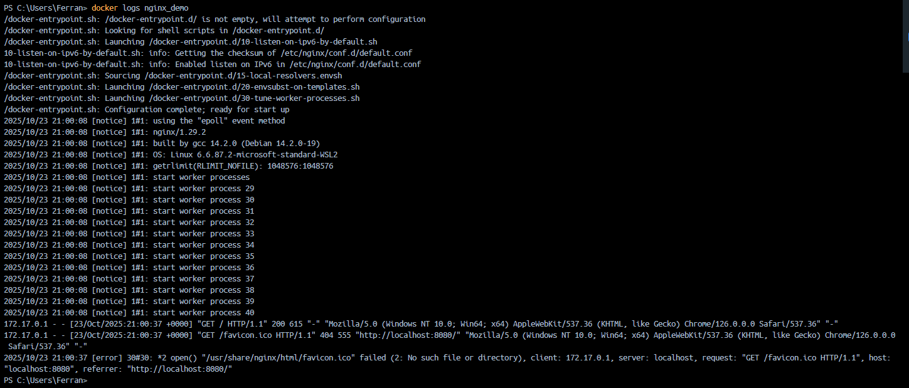

# Entrega 1 — Fundamentos de Docker: Debian, Nginx y NextCloud

**Alumno:** Ferran Azpiazu Adrover

---

## Índice

- [Introducción](#introducción)
- [Requisitos previos](#requisitos-previos)
- [Parte A](#parte-a)
  - [1) Comprobar instalación y permisos](#1-comprobar-instalación-y-permisos)
  - [2) hello-world y contenedores](#2-helloworld-y-contenedores)
  - [3) Debian interactivo y persistencia](#3-debian-interactivo-y-persistencia)
  - [4) Nginx en background](#4-nginx-en-background)
  - [5) Nextcloud (sqlite)](#5-nextcloud-sqlite)
- [Parte B](#parte-b)
- [Subir la entrega](#subir-la-entrega)
- [Notas finales](#notas-finales)

---

## Introducción

Este documento explica paso a paso cómo realizar la entrega usando Docker Desktop en Windows. Incluye los comandos exactos (PowerShell/CMD), capturas de pantalla ya incluidas y una breve explicación de lo que se observa en cada imagen.

## Requisitos previos

- Docker Desktop para Windows instalado y en ejecución.
- PowerShell o CMD (usuario normal).
- Git inicializado en el repositorio.

---

## Parte A

### 1) Comprobar instalación y permisos

Objetivo: comprobar que Docker Desktop está funcionando y que el usuario puede usar Docker sin privilegios.

Comandos (PowerShell/CMD):

```powershell
docker --version
docker info
```

Imagen: versión e info de Docker


Breve descripción: salida de `docker --version` y fragmento de `docker info` para confirmar que el motor está activo.

### 2) hello-world y contenedores

Objetivo: ejecutar `hello-world`, comprobar la salida, listar contenedores y borrar el contenedor.

Comandos:

```powershell
docker run --name prueba_hello hello-world
docker ps -a
docker ps -a --filter "status=exited"
docker rm prueba_hello
```

Salida del hello-world


Lista de contenedores (incluye contenedor Exited)


Comprobación tras borrar el contenedor


### 3) Debian interactivo y persistencia

Objetivo: crear un contenedor Debian interactivo, instalar `nano`, salir y comprobar persistencia.

Comandos:

```powershell
docker run -it --name deb_test debian:latest bash
# dentro del contenedor:
apt update
apt install -y nano
nano --version
exit
docker ps -a
docker start -ai deb_test
nano --version
exit
docker rm deb_test

# crear un contenedor nuevo desde la imagen base
docker run -it --name deb_test2 debian:latest bash
nano --version || echo "nano no está instalado"
exit
docker rm deb_test2
```

Instalación de nano dentro del contenedor


Salida de `docker ps -a` mostrando el contenedor detenido


Comprobación al volver a entrar (nano presente)


Nuevo contenedor sin nano instalado (deb_test2)


Breve explicación: los cambios dentro de un contenedor se mantienen mientras el contenedor exista; si borras el contenedor y creas uno nuevo desde la imagen base, los cambios no persisten.

### 4) Nginx en background

Objetivo: ejecutar Nginx en modo demonio, comprobar que responde en el puerto mapeado y mostrar logs.

Comandos:

```powershell
docker run -d --name nginx_demo -p 8080:80 nginx:latest
docker ps
docker logs nginx_demo
```

Salida de `docker run -d` y `docker ps` con Nginx en ejecución


Página de bienvenida de Nginx (navegador)


Logs del contenedor Nginx


Breve explicación: la imagen oficial de Nginx arranca el servidor con el comando por defecto y por eso no hay que pasar un comando extra.

### 5) Nextcloud (sqlite)

Objetivo: ejecutar Nextcloud usando la imagen oficial y localizar la base de datos sqlite.

Comandos:

```powershell
docker volume create nextcloud_data
docker run -d --name nextcloud_demo -p 8081:80 -v nextcloud_data:/var/www/html nextcloud:latest
docker exec -it nextcloud_demo bash
ls -la /var/www/html/data
exit
```

Nextcloud en ejecución (docker ps)


Instalador web de Nextcloud (navegador)


Ficha de la base de datos sqlite dentro del contenedor


Nota sobre personalizar el nombre del sqlite: la imagen oficial no ofrece una variable de entorno para cambiar directamente el nombre del fichero sqlite. Puedes montar un volumen con un fichero sqlite precreado o modificar `config.php`.

---

## Parte B — Servidor web con Nginx (entrega modificada)

Objetivo: crear un contenedor demonio llamado `servidor_web` y exponerlo en el puerto 8181 del host.

Comandos:

```powershell
docker run -d --name servidor_web -p 8181:80 nginx:latest
docker ps
docker images
# Parar y borrar
docker stop servidor_web
docker rm servidor_web
```

Creación y ejecución del contenedor `servidor_web`


Acceso desde el navegador a http://localhost:8181


Listado de imágenes locales


Salida tras parar y borrar el contenedor (docker ps -a)


---

## Subir la entrega

Comandos Git sugeridos (PowerShell):

```powershell
git add README.md images/*
git commit -m "Entrega 1: README con capturas insertadas"
git push origin main
```

---

## Notas finales

- Guarda las capturas en la carpeta `images/` dentro del repositorio.
- Si trabajas en WSL o en otra máquina, usa la IP de la máquina para acceder desde el navegador (ej. http://192.168.x.x:8181).
- Si quieres, renombro las imágenes para que sean más descriptivas.

---

---

_Documento preparado para entrega._  
Fecha: 2025-10-23  
Contacto: Ferran (repositorio de clase)

